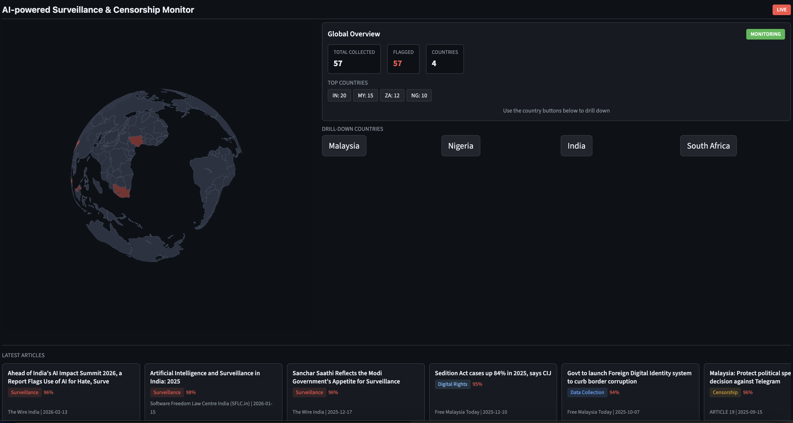

# AI-powered Surveillance & Censorship Monitor

**A real-time command center that tracks global surveillance and censorship using AI-powered news analysis.**

This prototype monitors 4 designated countries — **India, Malaysia, Nigeria, and South Africa** — with plans to expand to full global coverage. It ingests RSS feeds from 64 news sources, classifies articles with LLMs, and renders a live dashboard with a 3D rotating globe, country-level drill-downs, embedded news streams, and AI-generated article summaries.


---

## What It Does

The monitor continuously scans news from wire services, major outlets, digital rights organizations, and regional sources to detect and categorize surveillance and censorship activity in near real-time. The current prototype focuses on 4 countries, with the architecture designed to scale to global coverage.

**8 categories tracked:** surveillance, censorship, facial recognition, internet shutdowns, data collection, social media control, digital rights, other

### Dashboard at a Glance

#### Global View
3D rotating globe with focus country highlighting, global summary, drill-down buttons, and scrollable news card feed.



#### Country Drill-Down
Country analysis panel with category distribution, confidence stats, key themes, and embedded live news stream.


#### Article Detail
News feed with AI-generated summaries, metadata, and embedded original article view.


## Quick Start

### Demo Mode (no API keys needed)

```bash
pip install -r requirements.txt
python scripts/seed_data.py        # Creates DB and loads 79 verified articles
streamlit run dashboard/app.py     # Launch the dashboard
```

The 79 seed articles are real, web-verified stories spanning 13 countries and 7 categories. The full dashboard runs out of the box.

### Live Ingestion

```bash
cp .env.example .env
# Fill in:
#   OPENAI_API_KEY=sk-...         (required)
#   ANTHROPIC_API_KEY=sk-ant-...  (required)
#   YOUTUBE_API_KEY=AIza...       (optional — enables live stream embeds)

python scripts/run_ingestion.py          # Continuous, every 30 min
python scripts/run_ingestion.py --once   # Single pass
```

## Architecture

```
RSS Feeds (64 sources)
        |
        v
+-------------------+       +----------------+
| Ingestion Worker  | ----> |   SQLite DB    |
| (classify + store)|       |  (WAL mode)    |
+-------------------+       +----------------+
                                    |
                                    v  (read-only)
                      +-------------------------+
                      |   Streamlit Dashboard   |
                      |   (single-window layout)|
                      +-------------------------+
                       |      |       |       |
                    Globe  Analysis  News   Streams
                           Panel    Feed   & Webcams
```

**Two independent processes** share one SQLite database:

1. **Ingestion worker** — fetches RSS, deduplicates by URL hash (SHA-256), classifies via LLM (GPT-4.1-mini primary, Claude Haiku 4.5 fallback), stores to SQLite
2. **Streamlit dashboard** — reads the DB in read-only mode, renders the command center with auto-refresh every 60 seconds

## Key Features

### Intelligence Pipeline
- **Dual LLM classification** — OpenAI primary with automatic Anthropic fallback. Each article gets a category, country code, and confidence score.
- **AI article summaries** — LLM-generated English summaries for all articles, displayed in a styled panel when viewing article details
- **URL deduplication** — SHA-256 hashing of canonicalized URLs prevents duplicate ingestion
- **64 RSS feeds** across a 4-tier source taxonomy (wire services, major outlets, specialty/digital rights, regional)

### Dashboard
- **3D rotating globe** — deck.gl GlobeView with country polygon boundaries and focus country highlighting. Auto-rotates in global view, flies to selected country on drill-down.
- **Dynamic analysis panels** — generated live from DB articles: category distribution bars, confidence statistics, source tier breakdown, key themes extracted from titles
- **Live news streams** — embedded YouTube streams (4 primary + 4 fallback) with verified video IDs
- **City webcam grid** — 12 webcam slots across 4 countries
- **Article detail with AI summary** — select any article to see the LLM-generated summary and an embedded view of the original article page
- **News card feed** — horizontal scrollable cards filtered to focus countries, with category badges and confidence indicators

### Security
- SSRF protection (blocks private/reserved IPs in all URL handling)
- Parameterized SQL queries throughout
- HTML escaping in all rendering
- HTTPS-only iframe embeds with hostname validation
- postMessage origin validation in globe component
- Unicode bidi-override stripping on LLM outputs
- Sandboxed article page embeds (`allow-scripts allow-same-origin`)

## Project Structure

```
src/
  models.py            # Article/Feed dataclasses, URL canonicalization
  database.py          # SQLite layer (upsert, queries, read-only mode)
  llm_client.py        # OpenAI primary, Anthropic fallback
  classifier.py        # LLM-based surveillance/censorship classification
  summarizer.py        # LLM-based article summarization
  stream_resolver.py   # YouTube Data API v3 stream resolution
  url_utils.py         # SSRF/private-host validation
  ingestion.py         # RSS fetch worker with schedule loop

dashboard/
  app.py               # Main Streamlit app (single-window command center)
  components/
    analysis.py        # Dynamic analysis panels (category bars, themes, stats)
    map_globe.py       # 3D rotating globe (deck.gl GlobeView)
    article_detail.py  # Article detail with AI summary + original page embed
    live_stream.py     # Embedded YouTube live streams
    webcams.py         # Webcam grid
  static/
    globe_component/   # Streamlit bidirectional component for the globe
    geojson/           # Natural Earth boundary data (public domain)
  styles/
    dark_theme.css     # Dark command-center theme

config/
  feeds.yaml           # 64 RSS feed URLs with source tiers
  regions.yaml         # Drill-down regions (38 cities across 4 countries)
  streams.yaml         # Live stream URLs (4 primary + 4 fallback)
  webcams.yaml         # Webcam feed URLs (12 slots)

data/
  seed_articles.json   # 79 web-verified seed articles
```

## Source Tiers

| Tier | Type | Examples |
|------|------|----------|
| 1 | Wire services | Reuters, AP, AFP |
| 2 | Major international | BBC, Guardian, NYT, Al Jazeera, CNN, Washington Post |
| 3 | Specialty / digital rights | HRW, Amnesty, Freedom House, CPJ, EFF, Citizen Lab |
| 4 | Regional sources | NDTV, The Wire, Malaysiakini, Premium Times, Daily Maverick |

## Tech Stack

| Component | Technology |
|-----------|------------|
| Language | Python 3.11+ |
| Dashboard | Streamlit, streamlit-autorefresh |
| Maps | deck.gl 9.1.8 (GlobeView), Natural Earth GeoJSON |
| LLM providers | OpenAI (GPT-4.1-mini), Anthropic (Claude Haiku 4.5) |
| Database | SQLite (WAL mode) |
| RSS parsing | feedparser |
| Configuration | PyYAML, python-dotenv |

## Testing

```bash
python -m pytest tests/ -q     # 695 tests across 25 test files
```

## Configuration

| File | What it controls |
|------|-----------------|
| `config/feeds.yaml` | 64 RSS feed URLs with tier assignments |
| `config/regions.yaml` | 38 cities with coordinates for 4 drill-down countries |
| `config/streams.yaml` | YouTube live stream URLs (primary + fallback per country) |
| `config/webcams.yaml` | City webcam URLs |
| `.env` | API keys (OpenAI, Anthropic, YouTube) |

## Roadmap

- **Global expansion** — extend country coverage beyond the current 4 focus countries to full global monitoring
- **GDELT integration** — supplement RSS feeds with GDELT event data for broader coverage
- **Streaming responses** — real-time LLM output for article summaries

## Citation

If you use this software in your research, please cite:

```bibtex
@software{lian2026surveillance,
  author       = {Lian, Jie},
  title        = {{AI-powered Surveillance \& Censorship Monitor}},
  year         = {2026},
  url          = {https://github.com/LIANJie-Jason/ai-surveillance-monitor},
}
```

GitHub also provides a "Cite this repository" button via the [`CITATION.cff`](CITATION.cff) file.

## License

MIT
